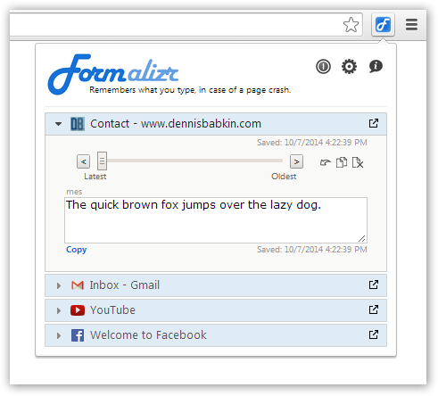
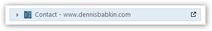
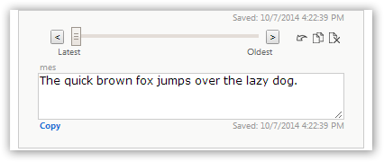
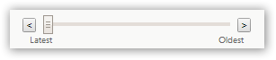
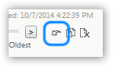
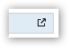
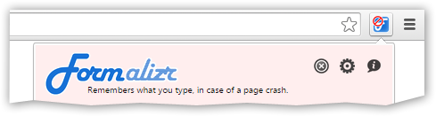
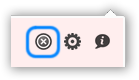
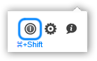
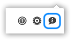

# Formalizr
*Formalizr, Google Chrome extension - "Remembers what you type, in case of a page crash."*

### Release Files

Can be [downloaded](https://dennisbabkin.com/formalizr/) as a Google Chrome extension.
*(Note that release files are minified.)*

### Basic Operation

As you type into text boxes in web pages:

 Formalizr will try to remember the changes you make. This will be reflected in the app's badge icon  that will display the number of text boxes that it collects input from.

-------

To check the state of the Formalizr app look at its badge icon:

-   Default state, with no data collection on the page.

-   Collecting data from 4 text boxes on the page.

-   Incognito browsing (must be enabled in the web browser settings.)

-   Formalizr is inactive (for example, due to unsupported page URL.)

-   Data collection is turned off on all web pages.

-   Data is not collected on the page due to the Site or Page Exception.

-------

You can view all collected data by clicking the Formalizr badge icon  to show the popup window: 

 Click on the page title  to open the data collected for it: 

Use the slider  to see changes to collected text over time as you typed it. If the text doesn't fit into the box use the corner gripper  to resize it.

-------

To retrieve previously typed text, click the 'Copy' link undernearth  to copy it to the Clipboard. You can then paste it anywhere else. You can also click the 'Copy All' button  to copy additional data from all available text boxes on the page.

-------

If you are at the web page where the data was collected from, you can use the 'Form Fill' button  to restore all collected data straight into the web page itself. You can get to the original page where the data was collected from by clicking the URL link  in the page title.

-------

To remove data collected for the page, click the 'Remove Page Data' button  and confirm removal. (Make sure to do so while not browsing the page whose data you're removing.)

-------

Use the 'Off' button  to turn off data collection from all web pages. When data collection is turned off:

 use the 'On' button  to turn data collection back on. Additionally you can Shift-click the 'On/Off' button  to toggle the Site Exception for the current page (or when data collection is turned off for a specific web site.) Likewise, you can ⌘-Shift-click (or Ctrl-Shift-click on Windows/Linux) the 'On/Off' button  to toggle the Page Exception for the current page (or when data collection is turned off for a specific web page.) Note that Exceptions can be adjusted later in the Options window.

-------

Use the 'Show options' button  to display the Options window that allows advanced users to adjust Formalizr settings. Or, click the 'Show app information' button  to learn additional information about the Formalizr or to contact our support team.

-------

There are some circumstances when Formalizr will not be able to collect data from the web page:

- Data is not collected from Java, Flash, Silverlight or similar plug-ins.

- Data may not be collected from pages supporting their own draft saving (such as Google Docs, Microsoft Office Online, and others.)

- Data may not be collected from text boxes supporting their own input formatting (such as specialized html markup input, etc.)

----------

For additional information check our [FAQ page](https://dennisbabkin.com/php/faq.php?what=formalizr).
